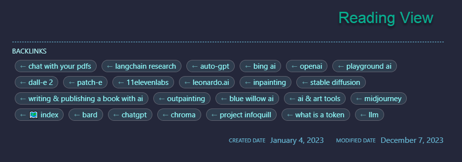

# 🦶 Obsidian Rich Foot
Obsidian Rich Foot automatically adds the following style elements to your notes in Reading View:
- **_Backlinks_**
- **_Created Date_**
- **_Modified Date_**

---

## Instalation

- copy the [scripts/obsidian-rich-foot/](./obsidian-rich-foot/scripts/obsidian-rich-foot/) folder to your Obsidian vault (suggested to save it to a "./scripts/obsidian-rich-foot" folder).
  
  

---

## Usage

- Add the following line to the bottom of any Obsidian note.  
  (ensure the path to the script that you copied to your vault in the *Installation* step above is correct)

    ```javascript
    `$= await dv.view("= scripts/obsidian-rich-foot")`
    ```

---

## Example




---

_note: live preview not supported_

---

### My Obsidian GitHub Projects

- 🚩 [Obsidian Custom Banner Image](https://github.com/jparkerweb/obsidian-custom-banner-image)
- 🦶 [Obsidian Rich Foot](https://github.com/jparkerweb/obsidian-rich-foot)
- 🌅 [Obsidian Image From Field](https://github.com/jparkerweb/obsidian-image-from-field/blob/main/README.md)
- 🌟 [Obsidian Element Enhancer](https://github.com/jparkerweb/obsidian-element-enhancer)
- ⏹ [Obsidian Bullet Cards](https://github.com/jparkerweb/obsidian-bullet-cards)
